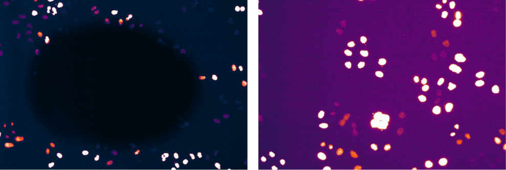

# 0. Preprocess Movies

## A. Quality Control

Mitosis movies were pre-preprocessed by Mitocheck in a two-step quality control procedure based on automatic and manual inspection of data (see [quality control](https://static-content.springer.com/esm/art%3A10.1038%2Fnature08869/MediaObjects/41586_2010_BFnature08869_MOESM58_ESM.pdf) section of original paper's methods for more details).
This step was applied before the movies were uploaded to IDR and thus the downloaded data only includes data that has been pre-preprocessed by MitoCheck.

Well A1 from each plate was also discarded, as each of these wells had an irregular illumination function. 

**Figure 1**: *Illumination function of an example A1 well (left) vs a typical illumination function (right).*

While a typical microscopy illumination function involves vignetting in the image (as demonstrated in every well besides A1), this was not the case for any A1 well that was manually inspected (figure 1).
This irregular illumination function led to errors in illumination correction later in preprocessing.

## A. Quality Control
